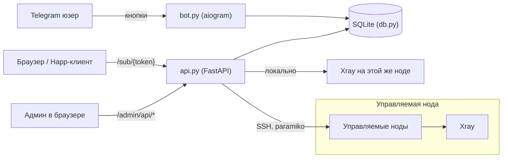
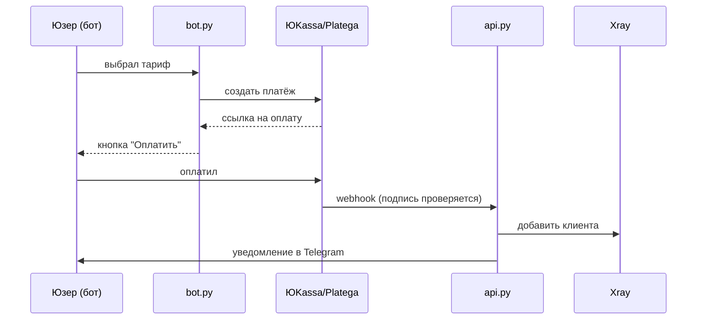
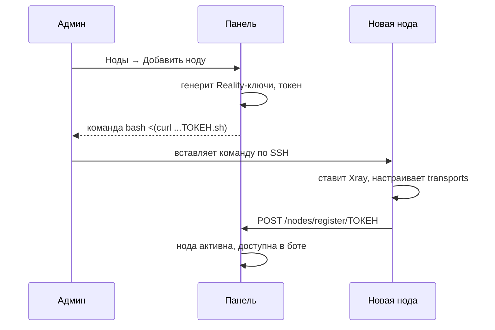

# MBS Panel

Самостоятельная VPN-панель на VLESS+Reality (+ gRPC/XHTTP/WS-TLS транспорты) и Hysteria2. Телеграм-бот для выдачи подписок, веб-сайт с личным кабинетом, и админ-панель для управления нодами, юзерами и трафиком — всё в одном репозитории, без сторонних панелей типа x-ui или Marzban под капотом.

Сделано by savsis. Изначально писалось под конкретный проект (шеринг VPN среди своих), но получилось достаточно универсально, чтобы выложить как есть.

## Что внутри

- **Бот** (aiogram 3) — выдача подписок по кнопкам, гифт-коды, привязка тарифов (7 дней / месяц / 3 месяца / полгода / год), автоматическое отключение по истечении подписки (не раз в полчаса, а раз в 90 секунд — важно, чтобы просрочка реально обрывала доступ, а не продолжала работать).
- **API + сайт** (FastAPI) — страница подписки со ссылкой `happ://` и QR-кодом, личный кабинет, JSON API для сайта.
- **Админ-панель** (чистый HTML/CSS/JS, без фреймворков и сборки) — дашборд, полная карточка юзера (история подписок, ручная выдача, устройства), подписки, гифт-коды, ноды (полное редактирование, не только вкл/выкл), трафик по Stats API самого Xray со сбросом счётчика по клику.
- **Мультинодовость** — добавляешь новую ноду в панели, получаешь одну команду `bash <(curl ...)`, вставляешь на чистый сервер — нода сама ставит Xray, генерит ключи, регистрируется в панели. Как у Remnawave/3x-ui, только свой велосипед.
- **Протоколы на выбор при добавлении ноды**: VLESS TCP+Reality, VLESS gRPC+Reality, VLESS XHTTP+Reality, VLESS WS+TLS (с реальным Let's Encrypt сертификатом), Hysteria2 (QUIC, отдельный процесс, obfs).
- **Лимит устройств (HWID)** — как у Remnawave, опционально: ограничение числа устройств на подписку через `x-hwid` заголовок.
- **Приём оплаты** — ЮKassa и Platega из коробки, опционально; без них бот просто бесплатно выдаёт по кнопке.
- **CLI `mbs`** — управление панелью прямо с сервера: пароль, статус, рестарт, логи.

## Архитектура



Панель и первая VPN-нода живут на одном сервере. Дополнительные ноды подключаются по SSH (management-ключ, генерится сам при первом добавлении ноды) — панель не устанавливает на себя ничего от ноды, только управляет клиентами через SSH-команды и Xray Stats API.

### Поток оплаты (когда `PAYMENTS_ENABLED=true`)



Панель и первая VPN-нода живут на одном сервере. На 443 порту нельзя одновременно держать и настоящий HTTPS (для сайта/подписки), и замаскированный под HTTPS VLESS+Reality трафик — поэтому перед Xray стоит `nginx stream` модуль с `ssl_preread`, который смотрит SNI входящего TLS-соединения и роутит: домены панели/подписки идут на nginx-бэкенд, всё остальное (в том числе Reality-трафик с левым SNI) — на Xray.

## Установка — одна команда

Нужен чистый сервер на **Ubuntu 22.04/24.04** или **Debian 11/12**, root-доступ и три поднятых DNS A-записи (см. таблицу ниже).

```bash
git clone https://github.com/devsavsis/mbs-panel.git && cd mbs-panel && sudo bash install.sh
```

Скрипт спросит домен панели, домен подписки, токен бота от [@BotFather](https://t.me/BotFather) и список Telegram ID админов — и дальше всё сам: ставит зависимости, Xray, nginx, выпускает сертификаты Let's Encrypt, генерирует Reality-ключи, поднимает systemd-сервисы, настраивает firewall (ufw) и fail2ban. В конце покажет пароль от админки и ссылку на панель.

### DNS-записи

Подними их **до** запуска `install.sh` — иначе Let's Encrypt не сможет выпустить сертификаты.

| Запись | Тип | Куда указывает | Зачем |
|---|---|---|---|
| `panel.example.com` | A | IP сервера панели | Админка (веб-интерфейс) |
| `sub.example.com` | A | IP сервера панели | Страница подписки + личный кабинет |
| `de1.example.com` | A | IP сервера панели | Адрес, на который подключаются VPN-клиенты (первая нода) |

Для каждой **дополнительной** ноды (добавляется позже через панель) — ещё одна A-запись на IP той ноды, например `de2.example.com`, `nl1.example.com` и т.д. Панель сама подскажет, какую запись нужно создать, и выдаст готовую команду установки, когда жмёшь «Добавить ноду».

Если Cloudflare — держи эти записи **DNS only** (серое облако), не проксируй: и Reality-трафику, и Let's Encrypt нужен прямой доступ до сервера.

### После установки

- Зайди на `https://panel.example.com`, залогинься паролем из вывода скрипта.
- Смени пароль в любой момент: `mbs pass новый_пароль` (без аргумента — сгенерит случайный).
- В боте у себя (Telegram ID из ADMIN_IDS) появится админ-меню.

В конце установки `install.sh` шлёт один пинг на `stats.api.savsis.xyz` (только название ОС) — просто счётчик "сколько раз панель установили", никаких доменов/токенов/паролей туда не уходит, IP не сохраняется. Отключить: `MBS_SKIP_STATS=1 sudo bash install.sh`.

## CLI `mbs`

Ставится автоматически в `/usr/local/bin/mbs`.

```
mbs pass [пароль]   сменить пароль админ-панели (без аргумента — случайный)
mbs status           статус bot / api / xray / nginx
mbs restart          перезапустить bot + api
mbs logs [bot|api|xray]   последние строки лога (по умолчанию api)
mbs domain            текущий домен панели
```

## Добавление ноды

В панели: Ноды → Добавить ноду → выбираешь страну, протоколы (Reality-транспорты всегда включены, WS+TLS и Hysteria2 — опционально) → получаешь команду вида:

```bash
bash <(curl -Ls https://panel.example.com/install/ТОКЕН.sh)
```

Вставляешь на чистый сервер (тот же Ubuntu 22/24 или Debian 11/12) — нода сама всё ставит и регистрируется. Если включал WS+TLS — скрипт выпустит для неё отдельный Let's Encrypt сертификат (нужна ещё одна A-запись, см. таблицу выше). Если включал Hysteria2 — поднимет отдельный процесс на UDP.



## Приём оплаты

По умолчанию бот выдаёт подписки бесплатно по кнопке — платежи выключены (`PAYMENTS_ENABLED=false`). Чтобы продавать доступ:

1. Заведи аккаунт в [ЮKassa](https://yookassa.ru) и/или [Platega](https://platega.io) — оба требуют реального ИП/самозанятости и проходят собственную проверку (реквизиты, сайт с офертой). Панель это не автоматизирует.
2. В `.env`: `PAYMENTS_ENABLED=true`, цены на тарифы (`PRICE_7D`, `PRICE_1M` и т.д. в рублях), и креды провайдера(ов) — `YOOKASSA_SHOP_ID`/`YOOKASSA_SECRET_KEY` и/или `PLATEGA_MERCHANT_ID`/`PLATEGA_SECRET`, включив соответствующий `*_ENABLED`.
3. В личном кабинете провайдера пропиши webhook на `https://<PANEL_DOMAIN>/payments/webhook/yookassa` и/или `.../payments/webhook/platega`.
4. `mbs restart` — бот начнёт показывать способ оплаты вместо мгновенной выдачи, подписка активируется автоматически по вебхуку с уведомлением в Telegram.

Заполни реальными данными `site/offer.html` (публичная оферта) и `site/privacy.html` (политика конфиденциальности) перед подачей заявки в ЮKassa — они нужны для их проверки, шаблоны уже на сайте (`/offer.html`, `/privacy.html`), но с плейсхолдерами вместо твоих реквизитов.

## Лимит устройств (HWID)

Как в Remnawave — ограничение, сколько разных устройств может использовать одну подписку. Работает не через сам VPN-протокол (Xray физически не видит "железо" клиента), а на уровне выдачи самой подписки: современные клиенты (Happ, v2rayTun и т.д.) при запросе `/sub/{token}` шлют заголовок `x-hwid` — уникальный ID устройства. Панель запоминает первые N увиденных hwid на юзера; при попытке добавить N+1-е устройство — отказ (404 + заголовок `x-hwid-max-devices-reached`).

Выключено по умолчанию (`HWID_LIMIT_ENABLED=false`) — клиенты, которые не шлют `x-hwid`, при включённом лимите вообще не получат подписку, так что включай только если знаешь, что твои пользователи сидят на приложениях с поддержкой этого заголовка. `HWID_FALLBACK_LIMIT` — лимит по умолчанию для всех, в админке (Подписки → кнопка «Устройства» у юзера) можно посмотреть/удалить привязанные устройства и задать индивидуальный лимит.

## Стабильность и производительность

- `install.sh` ретраит все сетевые шаги (apt, git, pip, certbot, установка Xray) — 3 попытки с паузой, типичная причина падения свежих VPS-установок это не баги, а моргнувшая сеть/зеркало пакетов.
- SQLite в WAL-режиме + `synchronous=NORMAL` (стандартная безопасная связка для этого режима) — меньше блокировок между ботом и апи, которые пишут в одну базу параллельно.
- Индексы на всех горячих путях (`subscriptions(active, expires_at)` — дергается ботом каждые 90 секунд на проверку истечения; `subscriptions(tg_id)`, `devices(tg_id)`, `payments(status)`) — на паре сотен юзеров разницы не увидишь, но на тысячах — увидишь.
- CI гоняет не только синтаксис, а реальный импорт `api.py`/`bot.py` целиком плюс smoke-тесты платёжной и HWID-логики на живом Ubuntu — ловит баги при импорте/вайринге модулей до того, как они попадут на прод.

## Частые проблемы при установке

- **Certbot не может выпустить сертификат** — почти всегда значит DNS A-записи ещё не проехали (обнови и подожди 5-10 минут) или порт 80 занят чем-то ещё (`ss -ltnp | grep :80`).
- **Xray не стартует после установки** — `mbs logs xray`, почти всегда конфликт порта 443 с чем-то другим, что уже там висит (другая панель, старый nginx на 443 напрямую).
- **Панель недоступна, но сервисы `active`** — проверь `nginx -t` и `systemctl status nginx`, скорее всего SNI-роутер (`/etc/nginx/stream.d/mbs.conf`) не подхватился — `nginx -s reload` после любых правок туда вручную.

## Разработка / вклад

Код простой — без сборки фронта, без ORM, без лишних абстракций. `admin.html` — один файл, vanilla JS. Питон-часть — обычные функции, SQLite напрямую.

PR и issues welcome. CI на каждый пуш гоняет compile-check по питону, синтаксис-проверку шелл-скриптов и smoke-тест генерации install-скрипта ноды.

## Лицензия

MIT — см. [LICENSE](LICENSE).
