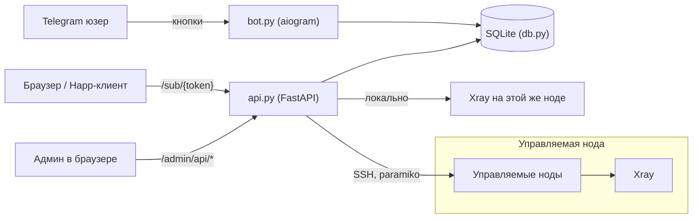
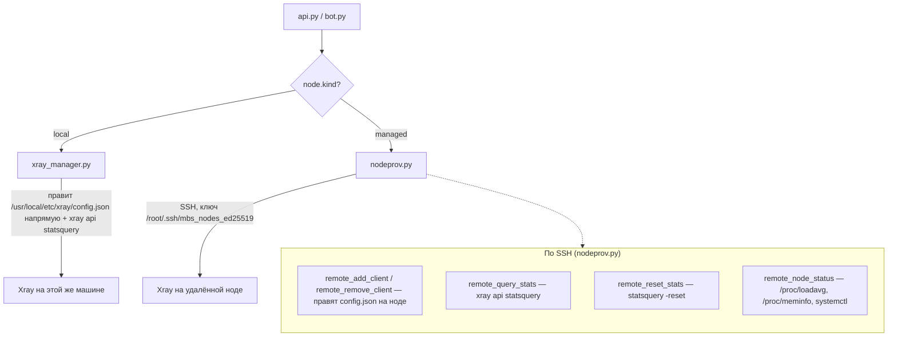
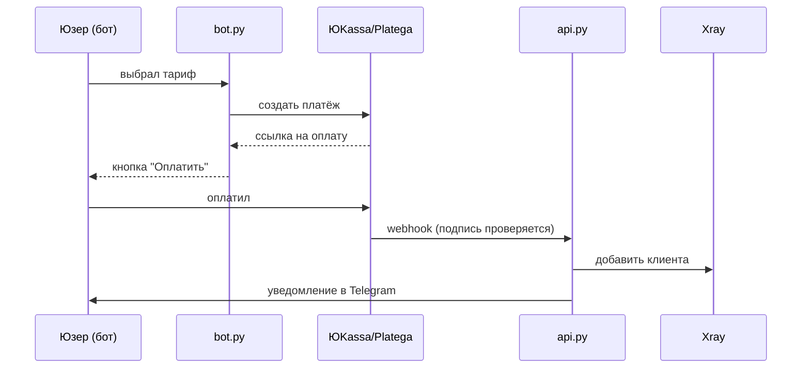
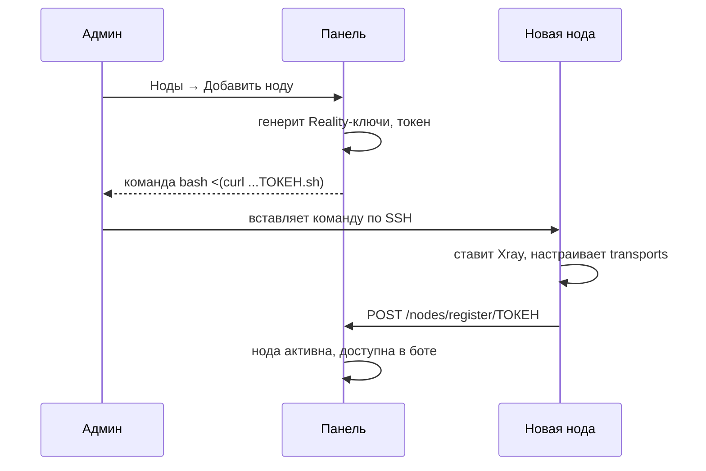

# MBS Panel

[](https://lab.savsis.xyz/savsisbtw/mbs-panel/actions)
[](LICENSE)
[](https://lab.savsis.xyz/savsisbtw/mbs-panel/releases)
[](https://www.python.org/)
[](https://github.com/XTLS/Xray-core)

Самостоятельная VPN-панель на VLESS+Reality (+ gRPC/XHTTP/WS-TLS транспорты) и Hysteria2. Телеграм-бот для выдачи подписок, веб-сайт с личным кабинетом, и админ-панель для управления нодами, юзерами и трафиком — всё в одном репозитории, без сторонних панелей типа x-ui или Marzban под капотом.

Сделано by savsis. Изначально писалось под конкретный проект (шеринг VPN среди своих), но получилось достаточно универсально, чтобы выложить как есть.

Лендинг с фичами и честным сравнением с Remnawave/Marzban: **[mbs.savsis.xyz](https://mbs.savsis.xyz)**

## Что внутри

- **Бот** (aiogram 3) — выдача подписок по кнопкам, гифт-коды, привязка тарифов (7 дней / месяц / 3 месяца / полгода / год), автоматическое отключение по истечении подписки (не раз в полчаса, а раз в 90 секунд — важно, чтобы просрочка реально обрывала доступ, а не продолжала работать).
- **API + сайт** (FastAPI) — страница подписки со ссылкой `happ://` и QR-кодом, готовый клиентский лендинг + личный кабинет (живут прямо в панели, подставляют название и реальные тарифы сами, ничего отдельно хостить не надо).
- **Своё название бренда** — панель, бот, сайт, страница подписки, оферта/политика показывают одно и то же настраиваемое название вместо дефолтного «MBS Panel», меняется в один клик из Настроек, применяется сразу.
- **Админ-панель** (чистый HTML/CSS/JS, без фреймворков и сборки) — дашборд, полная карточка юзера (история подписок, ручная выдача, устройства), подписки, гифт-коды, ноды (полное редактирование, не только вкл/выкл), трафик по Stats API самого Xray со сбросом счётчика по клику.
- **Мультинодовость** — добавляешь новую ноду в панели, получаешь одну команду `bash <(curl ...)`, вставляешь на чистый сервер — нода сама ставит Xray, генерит ключи, регистрируется в панели. Как у Remnawave/3x-ui, только свой велосипед.
- **Протоколы на выбор при добавлении ноды**: VLESS TCP+Reality, VLESS gRPC+Reality, VLESS XHTTP+Reality, VLESS WS+TLS (с реальным Let's Encrypt сертификатом), Hysteria2 (QUIC, отдельный процесс, obfs).
- **Лимит устройств (HWID)** — как у Remnawave, опционально: ограничение числа устройств на подписку через `x-hwid` заголовок.
- **Приём оплаты** — ЮKassa и Platega из коробки, опционально; без них бот просто бесплатно выдаёт по кнопке.
- **CLI `mbs`** — управление панелью прямо с сервера: пароль, статус, рестарт, логи, обновление.
- **Backup & Restore прямо в админке** — скачал архив (база + `.env`) одной кнопкой, восстановил загрузкой файла. Ни у Remnawave, ни у Marzban такого нет из коробки, только community-скрипты.
- **Мультиадминство + 2FA** — отдельные логины вместо одного пароля на всех, опциональная TOTP-двухфакторка (любой Google Authenticator/Authy) поверх пароля.
- **Проверка конфига Xray перед рестартом** — `xray run -test` плюс проверка что серты реально читаемы юзером, под которым крутится Xray, до того как что-то применится и уронит сервис.
- **Drag-n-drop ноды** — порядок нод в списке настраивается мышкой, как у Remnawave.
- **Rate-limit на вход** — по IP, отдельно на пароль и на 2FA-код.
- **Свой путь входа** — страницу логина можно увести с дефолтного `/admin` на любой другой (`ADMIN_PATH` в `.env`), доп. слой поверх rate-limit и 2FA — у Remnawave это в списке заявленных мер безопасности, у Marzban нет вообще.
- **Пауза подписки** — временно отключить доступ без потери оплаченных дней (Marzban это умеет, Remnawave — нет): при возобновлении срок сдвигается ровно на длительность паузы.
- **Исходящие вебхуки** — на оплату, выдачу/отзыв/паузу/возобновление подписки и на добавление/удаление/вкл-выкл ноды и создание/удаление/вкл-выкл цепочки, с HMAC-подписью тела. У Remnawave это события по юзерам и нодам, у Marzban — только по юзерам; мы покрываем оба класса.
- **Поиск и фильтр по подпискам** — по юзернейму/tg id/ноде/тарифу и по статусу, прямо в таблице. Плюс экспорт всех подписок в CSV одной кнопкой.
- **Цепочки серверов (v1.6)** — `клиент → нода A → нода B → интернет`: собираются в админке мышкой, зажал ЛКМ на клиенте и протянул провод через серверы к интернету. Больше двух серверов нельзя специально, на двух панель предупреждает про задержку и сама меряет RTT между нодами. Подробности ниже в разделе «Цепочки серверов».
- **Юзеры и выдача подписок (v1.6)** — отдельная страница со всеми, кто уже есть в системе, даже если подписок у них ни разу не было (в «Подписках» таких не видно): поиск по юзернейму и Telegram ID, счётчики активных подписок и устройств, кнопка «Выдать подписку». Можно выдать и по Telegram ID тому, кого в базе ещё нет, подписка дождётся, пока он зайдёт в бота.
- **Журнал действий (v1.6)** — кто из админов и когда менял ноды, цепочки, подписки, настройки, качал бэкап и входил (включая неудачные входы с IP). Пароли и ключи в журнал не попадают, только факт действия.
- **Пинг нод и палитра команд (v1.6)** — живая задержка от панели до каждой ноды на дашборде и в списке нод; `Ctrl K` открывает поиск по страницам, нодам, цепочкам и действиям. Акцентный цвет панели меняется кружками сверху.

- **Лимит трафика (v1.7)** — на каждую подписку, по умолчанию из настроек и отдельно у каждой в таблице. Панель сама считает трафик (переживает рестарт xray), при превышении отключает доступ и пишет юзеру в бота, а в таблице видно «лимит». Подняли лимит или сбросили счётчик — подписка сама включается обратно.
- **Пробный период (v1.7)** — кнопка в боте, один раз на человека: сколько дней, сколько ГБ и на какой ноде, настраивается в админке.
- **Промокоды (v1.7)** — скидка в процентах, в рублях или бонусные дни. Лимит использований, срок действия, один раз на юзера. Код списывается только когда оплата реально прошла, а не при создании счёта.
- **Напоминания и алерты (v1.7)** — юзеру за 3 дня и за сутки до конца подписки (с кнопкой «Продлить»), админам в Telegram когда нода падает или поднимается.
- **Оплата криптой (v1.7)** — CryptoBot рядом с ЮKassa и Platega, счёт в рублях, оплата любой монетой.
- **Публичный API (v1.7)** — токены в настройках, по ним скрипты и ресселлеры выдают, продлевают и отзывают подписки. Описание ниже.
- **Форматы подписки (v1.7)** — Clash/Mihomo и sing-box кроме обычного списка ссылок, формат определяется по клиенту или параметром `?format=`.
- **Зашифрованные бэкапы в Telegram (v1.7)** — по расписанию или по кнопке, шифруются парольной фразой, открываются командой `mbs decrypt`.
- **Перенос с 3x-ui и Marzban (v1.7)** — загрузил файл базы, выбрал ноду, клиенты переехали с теми же UUID.
- **График трафика, заметки о юзерах, пакетные действия (v1.7)** — трафик по дням на странице «Трафик», заметки к юзерам с поиском по ним, выбор нескольких подписок галочками и продление или отзыв разом.

## Архитектура



Панель и первая VPN-нода живут на одном сервере. Дополнительные ноды подключаются по SSH (management-ключ, генерится сам при первом добавлении ноды) — панель не устанавливает на себя ничего от ноды, только управляет клиентами через SSH-команды и Xray Stats API.

### Связь панели с нодой

Два разных пути в зависимости от типа ноды (`node.kind` в БД):



Публичный (`.pub`) ключ отдаётся самим install-скриптом ноды при первом запуске (`curl .../mgmt-pubkey.txt >> authorized_keys`) — панель никогда не просит пароль от новой ноды, только добавляет туда свой ключ через сам же install-скрипт, который админ запускает руками на новом сервере.

### Поток оплаты (когда `PAYMENTS_ENABLED=true`)



Панель и первая VPN-нода живут на одном сервере. На 443 порту нельзя одновременно держать и настоящий HTTPS (для сайта/подписки), и замаскированный под HTTPS VLESS+Reality трафик — поэтому перед Xray стоит `nginx stream` модуль с `ssl_preread`, который смотрит SNI входящего TLS-соединения и роутит: домены панели/подписки идут на nginx-бэкенд, всё остальное (в том числе Reality-трафик с левым SNI) — на Xray.

## Установка — одна команда

Нужен чистый сервер на **Ubuntu 22.04/24.04** или **Debian 11/12**, root-доступ и три поднятых DNS A-записи (см. таблицу ниже).

```bash
bash <(curl -Ls https://lab.savsis.xyz/savsisbtw/mbs-panel/raw/branch/main/install.sh)
```

(или так: `git clone https://lab.savsis.xyz/savsisbtw/mbs-panel.git && cd mbs-panel && sudo bash install.sh`. Основной репозиторий лежит на lab.savsis.xyz, GitHub и api.savsis.xyz остаются зеркалами на случай, если lab недоступен, установщик и `mbs update` сами переключаются на них)

Скрипт спросит домен панели, домен подписки, токен бота от [@BotFather](https://t.me/BotFather) и список Telegram ID админов — и дальше всё сам: ставит зависимости, Xray, nginx, выпускает сертификаты Let's Encrypt, генерирует Reality-ключи, поднимает systemd-сервисы, настраивает firewall (ufw) и fail2ban. В конце покажет пароль от админки и ссылку на панель.

### DNS-записи

Подними их **до** запуска `install.sh` — иначе Let's Encrypt не сможет выпустить сертификаты.

| Запись | Тип | Куда указывает | Зачем |
|---|---|---|---|
| `panel.example.com` | A | IP сервера панели | Админка (веб-интерфейс) |
| `sub.example.com` | A | IP сервера панели | Страница подписки + личный кабинет |
| `de1.example.com` | A | IP сервера панели | Адрес, на который подключаются VPN-клиенты (первая нода) |

Для каждой **дополнительной** ноды (добавляется позже через панель) — ещё одна A-запись на IP той ноды, например `de2.example.com`, `nl1.example.com` и т.д. Панель сама подскажет, какую запись нужно создать, и выдаст готовую команду установки, когда жмёшь «Добавить ноду».

Если Cloudflare — держи эти записи **DNS only** (серое облако), не проксируй: и Reality-трафику, и Let's Encrypt нужен прямой доступ до сервера.

### После установки

- Зайди на `https://panel.example.com`, залогинься паролем из вывода скрипта.
- Смени пароль в любой момент: `mbs pass новый_пароль` (без аргумента — сгенерит случайный).
- В боте у себя (Telegram ID из ADMIN_IDS) появится админ-меню.
- На `https://sub.example.com` уже живёт готовый клиентский сайт (лендинг + личный кабинет) с подставленным названием и реальными тарифами — ничего отдельно разворачивать не нужно. Название меняется в Настройки → «Название» в панели, применяется сразу везде (сайт, бот, страница подписки, оферта/политика).

В конце установки `install.sh` шлёт один пинг на `stats.api.savsis.xyz` (только название ОС) — просто счётчик "сколько раз панель установили", никаких доменов/токенов/паролей туда не уходит, IP не сохраняется. Отключить: `MBS_SKIP_STATS=1 sudo bash install.sh`.

## CLI `mbs`

Ставится автоматически в `/usr/local/bin/mbs`.

```
mbs pass [пароль]   сменить пароль админ-панели (без аргумента — случайный)
mbs status           статус bot / api / xray / nginx
mbs restart          перезапустить bot + api
mbs logs [bot|api|xray]   последние строки лога (по умолчанию api)
mbs domain            текущий домен панели
mbs backup             полная копия панели в /root/mbs-backups (база, .env, твои правки, конфиг Xray)
mbs update [ссылка]    обновить код и перезапустить; со ссылкой на git-зеркало берёт обновление оттуда
mbs mirror [ссылка|off] показать / запомнить / убрать своё зеркало, его mbs update проверяет первым
```

`mbs update` тянет обновление (только fast-forward, чужую историю на сервере не мержит), ставит зависимости, **проверяет, что новый код вообще компилируется**, и только потом перезапускает. Если после рестарта `mbs-bot`/`mbs-api` не поднялись — сам откатывает на предыдущий коммит и поднимает его. `.env` и база (`mbs.db`) не в гите — их не тронет ни при каком раскладе.

Перед каждым обновлением `mbs update` сам снимает полную копию в `/root/mbs-backups/` (консистентный снапшот базы через backup API SQLite, `.env`, код вместе с твоими ручными правками, конфиг Xray, без `venv`), хранит 5 последних, права `600`. Не получилось сделать копию (нет места на диске), обновление даже не начнётся. То же вручную: `mbs backup`. Вернуть всё как было: `tar xzf /root/mbs-backups/mbs-before-update-<время>.tar.gz -C /` и `mbs restart`.

Если на сервере правили файлы руками (бывает, `bot.py`/`config.py`/`db.py` под себя), обновление больше на этом не падает: правки откладываются в `git stash` и сохраняются патчем в `local-changes/local-changes-<время>.patch`, потом подтягивается новая версия. Вернуть своё поверх новой: `git stash pop` (может быть конфликт, если новая версия правила те же строки, тогда смотри патч). Если новый код не прошёл проверку или сервисы не поднялись, откат на старый коммит возвращает и твои правки.

Источники по порядку: своё зеркало (если задано через `mbs mirror`), потом `lab.savsis.xyz`, потом `api.savsis.xyz`, потом GitHub. Установщик включает автообновление: каждый день около 04:00 сервер сам делает `mbs update` (перед ним всегда резервная копия). Выключить: `mbs autoupdate off`, включить обратно: `mbs autoupdate on`. Появилось новое зеркало или GitHub недоступен, а ссылка на репо есть: `mbs update https://example.com/путь/mbs-panel.git` возьмёт обновление именно оттуда, один раз. Чтобы всегда обновляться с него: `mbs mirror https://example.com/путь/mbs-panel.git` (убрать: `mbs mirror off`). Принимаются только `https://`, `http://`, `ssh://` и `git@хост:путь`, всё остальное (в том числе `file://` и хитрые транспорты типа `ext::`) отбрасывается, ветка берётся `main`.

## Добавление ноды

В панели: Ноды → Добавить ноду → выбираешь страну, протоколы (Reality-транспорты всегда включены, WS+TLS и Hysteria2 — опционально) → получаешь команду вида:

```bash
bash <(curl -Ls https://panel.example.com/install/ТОКЕН.sh)
```

Вставляешь на чистый сервер (тот же Ubuntu 22/24 или Debian 11/12) — нода сама всё ставит и регистрируется. Если включал WS+TLS — скрипт выпустит для неё отдельный Let's Encrypt сертификат (нужна ещё одна A-запись, см. таблицу выше). Если включал Hysteria2 — поднимет отдельный процесс на UDP.



## Цепочки серверов

Обычное подключение это `клиент → нода → интернет`. Цепочка добавляет второй прыжок: `клиент → нода A → нода B → интернет`. Сайты видят IP ноды B, а клиент коннектится к A. Пригождается, когда вход хочется держать в одном регионе (ближе, не режут), а выход нужен в другой стране. Больше двух серверов не даёт специально: каждый лишний прыжок это задержка, а скорость упирается в самое слабое звено.

Собирается в админке: Цепочки → зажимаешь ЛКМ на «Клиенте», тянешь провод через серверы из пула и отпускаешь на «Интернете». Пока ведёшь, сервер под курсором цепляется после короткой задержки (чтоб не хватать всё подряд по пути). Можно и без перетаскивания, просто кликами по серверам и по «Интернету», `Esc` сбрасывает. Один сервер это обычное подключение, оно и так есть у каждой ноды, а вот два уже цепочка: панель сразу показывает предупреждение про высокую задержку и замеряет реальный RTT между нодами (TCP-коннект с входной ноды до выходной).

Что реально происходит под капотом:

- на входной ноде появляется отдельный Xray-inbound `chain-<код>` (тот же Reality-ключ что у ноды, но свой порт из 10443–10999 и свой shortId), outbound `chain-<код>-out` до выходной ноды и routing-правило «всё из этого inbound уходит в этот outbound»;
- на выходной ноде заводится служебный клиент `relay-<код>`, под ним входная нода и ходит на выход (только на TCP+Reality inbound, на обоих прыжках `xtls-rprx-vision`);
- порт открывается в ufw сам, конфиг прогоняется через `xray run -test`, после рестарта проверяется что Xray реально поднялся, если нет, конфиг откатывается;
- подписчикам входной ноды в подписку добавляется ещё одна ссылка «A → B», подписчикам выходной цепочку не выдаём;
- любая проблема с цепочкой не блокирует обычную синхронизацию клиентов, они применятся в любом случае.

Ограничения: входом может быть только локальная или управляемая нода (панель правит её конфиг), выходом ещё и внешняя нода с общим UUID. Ноду, которая сидит в цепочке, удалить нельзя, сначала удали цепочку. И важный момент про Reality: SNI-маскировка (`dest`) не должна быть сайтом с пост-квантовым обменом ключами (например `www.microsoft.com`), на таком Reality не заводится вообще, ни в цепочке, ни без неё, проверено руками. Дефолтный `www.wildberries.ru` подходит.

## Приём оплаты

По умолчанию бот выдаёт подписки бесплатно по кнопке — платежи выключены (`PAYMENTS_ENABLED=false`). Чтобы продавать доступ:

1. Заведи аккаунт в [ЮKassa](https://yookassa.ru) и/или [Platega](https://platega.io) — оба требуют реального ИП/самозанятости и проходят собственную проверку (реквизиты, сайт с офертой). Панель это не автоматизирует.
2. В `.env`: `PAYMENTS_ENABLED=true`, цены на тарифы (`PRICE_7D`, `PRICE_1M` и т.д. в рублях), и креды провайдера(ов) — `YOOKASSA_SHOP_ID`/`YOOKASSA_SECRET_KEY` и/или `PLATEGA_MERCHANT_ID`/`PLATEGA_SECRET`, включив соответствующий `*_ENABLED`.
3. В личном кабинете провайдера пропиши webhook на `https://<PANEL_DOMAIN>/payments/webhook/yookassa` и/или `.../payments/webhook/platega`.
4. `mbs restart` — бот начнёт показывать способ оплаты вместо мгновенной выдачи, подписка активируется автоматически по вебхуку с уведомлением в Telegram.

Заполни реальными данными `site/offer.html` (публичная оферта) и `site/privacy.html` (политика конфиденциальности) перед подачей заявки в ЮKassa — они нужны для их проверки, шаблоны уже на сайте (`/offer.html`, `/privacy.html`), но с плейсхолдерами вместо твоих реквизитов.

## Лимит устройств (HWID)

Как в Remnawave — ограничение, сколько разных устройств может использовать одну подписку. Работает не через сам VPN-протокол (Xray физически не видит "железо" клиента), а на уровне выдачи самой подписки: современные клиенты (Happ, v2rayTun и т.д.) при запросе `/sub/{token}` шлют заголовок `x-hwid` — уникальный ID устройства. Панель запоминает первые N увиденных hwid на юзера; при попытке добавить N+1-е устройство — отказ (404 + заголовок `x-hwid-max-devices-reached`).

Выключено по умолчанию (`HWID_LIMIT_ENABLED=false`) — клиенты, которые не шлют `x-hwid`, при включённом лимите вообще не получат подписку, так что включай только если знаешь, что твои пользователи сидят на приложениях с поддержкой этого заголовка. `HWID_FALLBACK_LIMIT` — лимит по умолчанию для всех, в админке (Подписки → кнопка «Устройства» у юзера) можно посмотреть/удалить привязанные устройства и задать индивидуальный лимит.

## Лимиты, пробный период, промокоды

Всё включается в админке, в «Настройках» и на странице «Промокоды», рестарт не нужен.

- **Лимит трафика:** значение по умолчанию (ГБ, 0 — без лимита) попадает на каждую новую подписку. У конкретной подписки лимит меняется кнопкой «Лимит» в таблице подписок, там же видно, сколько уже израсходовано. Счётчик копится дельтами, так что рестарт xray ничего не обнуляет, а «Сбросить» на странице «Трафик» обнуляет и снова включает подписку, остановленную лимитом.
- **Пробный период:** галочка, число дней, лимит ГБ и код ноды (пусто — первая рабочая). В боте появляется кнопка «Попробовать бесплатно» у тех, у кого ещё не было подписок.
- **Промокоды:** `/promo КОД` в боте. Скидка применяется на следующей оплате, бонусные дни добавляются сразу.
- **Напоминания** и **алерты по нодам** включаются галочками там же.

## Публичный API

Токен создаётся в «Настройках», показывается один раз, хранится только хеш. Запросы идут на домен панели или подписки:

```bash
curl -H "Authorization: Bearer mbs_..." https://sub.example.com/api/v1/plans
curl -X POST -H "Authorization: Bearer mbs_..." -H "Content-Type: application/json" \
  -d '{"tg_id": 123456789, "node": "de1", "plan": "1m", "traffic_gb": 100}' \
  https://sub.example.com/api/v1/subscriptions
```

| метод | путь | что делает |
|---|---|---|
| GET | `/api/v1/me` | проверка токена |
| GET | `/api/v1/nodes`, `/api/v1/plans` | доступные ноды и тарифы |
| POST | `/api/v1/subscriptions` | выдать подписку: `tg_id`, `node`, `plan`, опционально `traffic_gb` |
| GET | `/api/v1/subscriptions/{uuid}` | состояние подписки, трафик, ссылка |
| GET | `/api/v1/users/{tg_id}/subscriptions` | все подписки юзера |
| POST | `/api/v1/subscriptions/{uuid}/extend` | продлить: `{"days": 30}` |
| POST | `/api/v1/subscriptions/{uuid}/revoke` | отозвать |

## Форматы подписки

Ссылка `https://sub.example.com/sub/ТОКЕН` отдаёт обычный список для Happ, v2rayN и им подобных. Clash, Stash и Mihomo получают YAML-конфиг сами, sing-box получает JSON. Явно: `?format=clash`, `?format=singbox`, `?format=base64`. Параметр `ru=1` добавляет к Clash-конфигу правила «российские сайты напрямую». XHTTP в Clash и sing-box не попадает: эти клиенты его пока не умеют.

## Бэкапы в Telegram и перенос

- В «Настройках» задай парольную фразу и включи отправку: копия (база и `.env`) шифруется и приходит админам в Telegram, через заданное число часов или по кнопке «Прислать сейчас». Расшифровать на сервере: `mbs decrypt файл.enc`, получится обычный архив, который принимает восстановление в админке. Фразу храни отдельно, без неё файл не открыть.
- Перенос клиентов: «Настройки», блок «Перенос с 3x-ui и Marzban». Читаются только клиенты VLESS, UUID сохраняются.

## Стабильность и производительность

- `install.sh` ретраит все сетевые шаги (apt, git, pip, certbot, установка Xray) — 3 попытки с паузой, типичная причина падения свежих VPS-установок это не баги, а моргнувшая сеть/зеркало пакетов.
- SQLite в WAL-режиме + `synchronous=NORMAL` (стандартная безопасная связка для этого режима) — меньше блокировок между ботом и апи, которые пишут в одну базу параллельно.
- Индексы на всех горячих путях (`subscriptions(active, expires_at)` — дергается ботом каждые 90 секунд на проверку истечения; `subscriptions(tg_id)`, `devices(tg_id)`, `payments(status)`) — на паре сотен юзеров разницы не увидишь, но на тысячах — увидишь.
- CI гоняет не только синтаксис, а реальный импорт `api.py`/`bot.py` целиком плюс smoke-тесты платёжной и HWID-логики на живом Ubuntu — ловит баги при импорте/вайринге модулей до того, как они попадут на прод.

## Частые проблемы при установке

- **Certbot не может выпустить сертификат** — почти всегда значит DNS A-записи ещё не проехали (обнови и подожди 5-10 минут) или порт 80 занят чем-то ещё (`ss -ltnp | grep :80`).
- **Xray не стартует после установки** — `mbs logs xray`, почти всегда конфликт порта 443 с чем-то другим, что уже там висит (другая панель, старый nginx на 443 напрямую).
- **Панель недоступна, но сервисы `active`** — проверь `nginx -t` и `systemctl status nginx`, скорее всего SNI-роутер (`/etc/nginx/stream.d/mbs.conf`) не подхватился — `nginx -s reload` после любых правок туда вручную.

## Разработка / вклад

Код простой — без сборки фронта, без ORM, без лишних абстракций. `admin.html` — один файл, vanilla JS. Питон-часть — обычные функции, SQLite напрямую.

PR и issues welcome. CI на каждый пуш гоняет compile-check по питону, синтаксис-проверку шелл-скриптов и smoke-тест генерации install-скрипта ноды.

## Авторы:
github.com/savsisbtw
github.com/welfizx

## Лицензия

MIT — см. [LICENSE](LICENSE).
